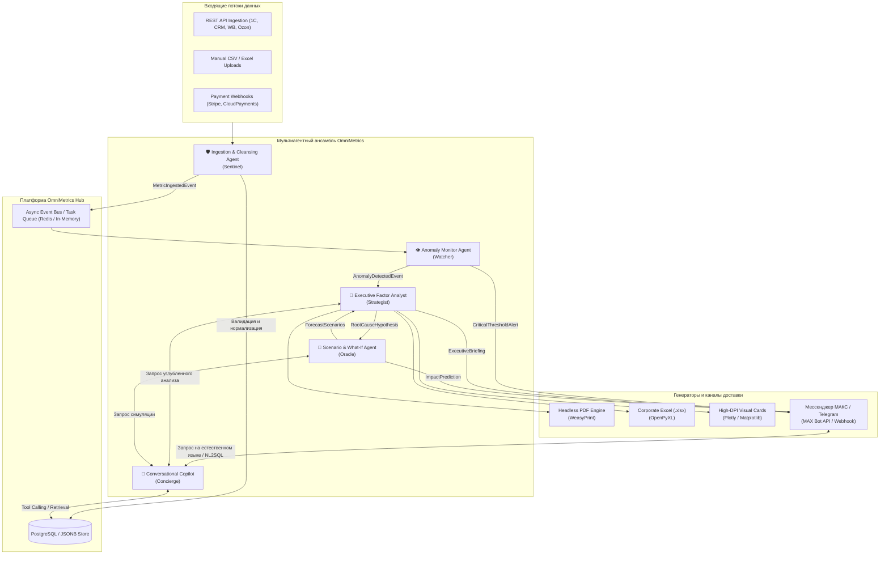
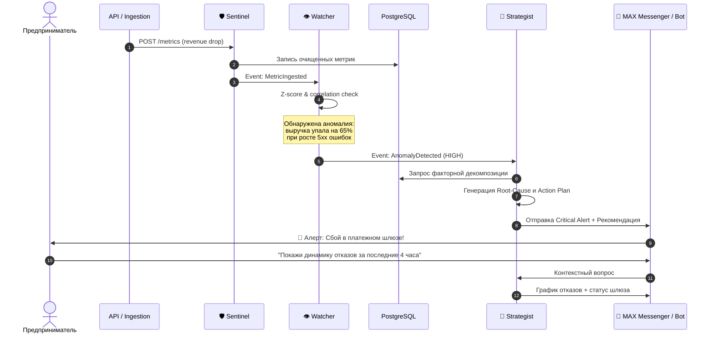
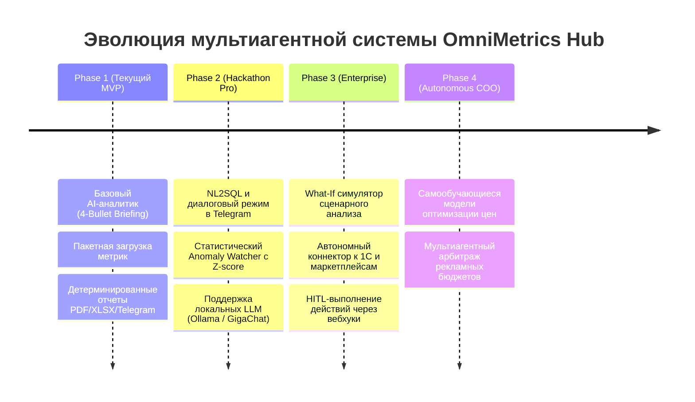

# 🤖 OmniMetrics Multi-Agent System Architecture (MAS)

> **Архитектурная спецификация и руководство по мультиагентной системе OmniMetrics Hub для автономного мониторинга, факторного анализа бизнеса и проактивного принятия решений.**

---

## 📑 Оглавление

1. [Обзор концепции и миссия агентной системы](#1-обзор-концепции-и-миссия-агентной-системы)
2. [Общая архитектура мультиагентного взаимодействия](#2-общая-архитектура-мультиагентного-взаимодействия)
3. [Спецификация автономных агентов](#3-спецификация-автономных-агентов)
   - [3.1 Ingestion & Cleansing Agent (Sentinel)](#31-ingestion--cleansing-agent-sentinel)
   - [3.2 Anomaly & Telemetry Monitor Agent (Watcher)](#32-anomaly--telemetry-monitor-agent-watcher)
   - [3.3 Executive Insight & Factor Analysis Agent (Strategist)](#33-executive-insight--factor-analysis-agent-strategist)
   - [3.4 Scenario Simulation & What-If Agent (Oracle)](#34-scenario-simulation--what-if-agent-oracle)
   - [3.5 Conversational Telegram Copilot Agent (Concierge)](#35-conversational-telegram-copilot-agent-concierge)
4. [Протокол взаимодействия агентов (Agent Communication Protocol)](#4-протокол-взаимодействия-агентов-agent-communication-protocol)
5. [Инструменты (Tool Calling / Function Calling API)](#5-инструменты-tool-calling--function-calling-api)
6. [Human-in-the-Loop (HITL) и границы безопасности](#6-human-in-the-loop-hitl-и-границы-безопасности)
7. [Интеграция с существующим стеком OmniMetrics Hub](#7-интеграция-с-существующим-стеком-omnimetrics-hub)
8. [Roadmap развития автономности](#8-roadmap-развития-автономности)

---

## 1. Обзор концепции и миссия агентной системы

Традиционные BI-системы (Tableau, PowerBI, Grafana) страдают от одного критического недостатка: **они пассивны**. Человек должен сам открыть дашборд, заметить проблему, вручную раскопать причину падения метрики и самостоятельно придумать решение. Для малого и среднего бизнеса (МСП), где нет штата дата-аналитиков, это приводит к запоздалой реакции и потере выручки.

**Мультиагентная система OmniMetrics Hub превращает пассивный сбор данных в проактивного цифрового бизнес-аналитика и операционного директора (COO-as-a-Service):**
- **Автономный мониторинг**: агенты непрерывно анализируют поток метрик, отслеживают не просто пороговые значения, а сложные межметрические корреляции.
- **Факторный анализ причин (Root-Cause Analysis)**: при падении выручки агент автоматически декомпозирует воронку (трафик $\to$ конверсия $\to$ средний чек $\to$ возвраты) и локализует причину вплоть до рекламной кампании, региона или сбоя платежного шлюза.
- **Сценарное моделирование (What-If)**: генерация прогнозов последствий управленческих решений.
- **Диалоговый Copilot в мессенджере МАКС и Telegram**: естественный диалог на русском языке без сложных SQL-запросов и обучения персонала.

---

## 2. Общая архитектура мультиагентного взаимодействия

Мультиагентный пайплайн построен по принципу **Orchestrated Event-Driven Multi-Agent Architecture**:



---

## 3. Спецификация автономных агентов

### 3.1 Ingestion & Cleansing Agent (Sentinel)

* **Роль**: Привратник данных и нормализатор схем.
* **Цель**: Обеспечить 100% валидность входящей телеметрии, исключить мусорные дубликаты, распознать опечатки в тегах и автоматически классифицировать единицы измерения.
* **Триггер**: Поступление метрик через `POST /api/v1/metrics` или `/batch`.
* **Функции и алгоритмы**:
  - Валидация типов данных и допустимых диапазонов (например, `conversion_rate` $\in [0, 100]\%$, `api_latency` $> 0$).
  - Нечеткое сопоставление тегов (Fuzzy matching): объединение `google-ads`, `google_ads` и `GoogleAds` в единый канонический тег `google_ads`.
  - Отсечение технических выбросов (ошибочные нулевые значения при сбоях датчиков или тестовые транзакции).
* **Системный промпт (при LLM-нормализации сложных CSV)**:
  ```text
  You are Sentinel, the Data Quality & Schema Mapping Agent.
  Analyze the incoming unstructured metric payloads. Map disparate field names 
  to the standard OmniMetrics schema: name (snake_case), value (float), unit (canonical),
  timestamp (ISO-8601 UTC), tags (key-value dictionary).
  Detect currency symbols and convert to standard ISO codes (RUB, USD, EUR).
  Reject corrupt payloads with explicit diagnostic errors.
  ```

---

### 3.2 Anomaly & Telemetry Monitor Agent (Watcher)

* **Роль**: Неусыпный часовой метрик бизнеса и инфраструктуры.
* **Цель**: Обнаруживать скрытые аномалии и резкие отклонения за секунды до того, как они нанесут ущерб выручке.
* **Триггер**: Фоновый цикл (каждые 5-15 минут) + событие записи метрик.
* **Функции и алгоритмы**:
  - **Статистический контроль**: Расчет динамического $Z$-score с учетом скользящего окна ($N=14$ дней) и межквартильного размаха ($IQR$).
  - **Сезонная декомпозиция**: Очистка от недельных и суточных паттернов (учет того, что в субботу и воскресенье трафик и заказы могут иметь естественный спад или всплеск).
  - **Многомерная корреляция**: Если падают `orders_count` при стабильном `visitors`, агент проверяет `api_latency_ms` и `http_5xx_errors` шлюза оплаты.
* **Выходные события**:
  - `AlertLevel.INFO`: Небольшое отклонение от скользящего среднего ($>1.5\sigma$).
  - `AlertLevel.WARNING`: Устойчивый негативный тренд ($>2\sigma$) на протяжении 3 интервалов.
  - `AlertLevel.CRITICAL`: Остановка заказов, рост 5xx ошибок или падение выручки ($>3\sigma$).

---

### 3.3 Executive Insight & Factor Analysis Agent (Strategist)

* **Роль**: Старший аналитик и стратегический консультант (C-Level Advisor).
* **Цель**: Синтезировать сложные таблицы метрик в предельно ясный, действенный управленческий отчет по методологии **MECE (Mutually Exclusive, Collectively Exhaustive)**.
* **Триггер**: Запрос отчета в Telegram, регламентная утренняя рассылка (Cron) или сигнал от Watcher.
* **Методология факторного анализа**:
  $$\text{Revenue} = \text{Traffic} \times \text{Conversion Rate} \times \text{Average Order Value (AOV)}$$
  Агент автоматически вычисляет вклад каждого фактора в общее изменение выручки ($\Delta \text{Revenue}$) в абсолютном и процентном выражении.
* **Формат вывода (Executive 4-Bullet Briefing)**:
  - 🚀 **Key Gain**: Ключевой драйвер роста (например: *«Рост выручки на +18.4% обеспечен масштабированием Email-маркетинга при неизменном CAC»*).
  - ⚠️ **Drop / Friction Point**: Узкое горлышко (например: *«Конверсия в мобильном приложении упала на 1.2 п.п. после релиза обновления»*).
  - 🔍 **Anomaly / Correlation**: Скрытая закономерность (например: *«Средний чек в регионе APAC вырос на 35% благодаря оптовым заказам в пятницу»*).
  - 🎯 **Recommended Action**: Одно конкретное управленческое действие с оценкой эффекта.
* **Поддерживаемые LLM бэкенды**:
  - Облачные: OpenAI GPT-4o / GPT-4o-mini, Anthropic Claude 3.5 Sonnet.
  - Суверенные / Локальные (On-Premise): Ollama (Llama 3, Qwen 2.5), YandexGPT, GigaChat.
  - Полный детерминированный fallback без LLM: библиотека эвристических правил (работает даже без интернета).

---

### 3.4 Scenario Simulation & What-If Agent (Oracle)

* **Роль**: Моделирование сценариев и предиктивная аналитика.
* **Цель**: Дать предпринимателю ответ на вопрос: *«Что произойдет, если мы примем решение X?»*
* **Триггер**: Запрос пользователя через Telegram-бота (например: */simulate*) или по кнопке в отчете.
* **Ключевые сценарии**:
  1. *«Что если поднять средний чек на 10% ценой потери 3% конверсии?»*
  2. *«Что если перераспределить 30% бюджета из Google Ads в Meta Ads?»*
  3. *«Какой прогноз кассового разрыва на следующие 30 дней с учетом текущего темпа возвратов?»*
* **Механика**:
  - Агент загружает исторические эластичности метрик из БД.
  - Строит базовый прогноз (экстраполяция тренда + учет сезонности).
  - Накладывает веса гипотезы и генерирует сравнительную таблицу (Pessimistic / Realistic / Optimistic сценарии).

---

### 3.5 Conversational Copilot Agent в мессенджере МАКС и Telegram (Concierge)

* **Роль**: Интеллектуальный интерфейс взаимодействия с пользователем в мессенджере.
* **Цель**: Предоставить предпринимателю возможность управлять аналитикой и получать ответы человеческим языком без знания SQL и интерфейсов дашбордов.
* **Триггер**: Любое текстовое или командное сообщение в мессенджере МАКС или Telegram-боте.
* **Архитектура диалога**:
  - **Intent Classifier**: Определение намерения (генерация отчета, свободный вопрос по данным, смена настроек, объяснение аномалии).
  - **NL2SQL / Semantic Query Tool**: Перевод вопроса *«Сколько мы заработали за прошлый вторник в США?»* в безопасный параметризованный запрос к `MetricRecord`.
  - **Chart-on-the-Fly**: Автоматический рендеринг графика и отправка картинки вместе с ответом.
  - **Session Memory**: Сохранение контекста предыдущих реплик для уточняющих вопросов (*«А по сравнению с позапрошлой неделей?»*).

---

## 4. Протокол взаимодействия агентов (Agent Communication Protocol)

Все агенты обмениваются стандартизированными типизированными сообщениями через внутреннюю шину событий:

```python
from dataclasses import dataclass
from datetime import datetime
from enum import Enum
from typing import Any, Dict, Optional

class AgentRole(str, Enum):
    SENTINEL = "sentinel"
    WATCHER = "watcher"
    STRATEGIST = "strategist"
    ORACLE = "oracle"
    CONCIERGE = "concierge"

class EventPriority(str, Enum):
    LOW = "low"
    NORMAL = "normal"
    HIGH = "high"
    CRITICAL = "critical"

@dataclass
class AgentMessage:
    message_id: str
    sender: AgentRole
    recipient: Optional[AgentRole]  # None = Broadcast
    event_type: str                 # e.g., "metric.anomaly.detected"
    priority: EventPriority
    timestamp: datetime
    payload: Dict[str, Any]
    correlation_id: str             # Сквозной ID цепочки рассуждений
```

### Сценарий автономной цепочки реагирования на инцидент



---

## 5. Инструменты (Tool Calling / Function Calling API)

Каждый агент оснащен строго типизированным набором инструментов (Tools):

| Агент | Доступные инструменты (Tools) | Назначение |
|---|---|---|
| **Sentinel** | `validate_schema(payload)`<br>`normalize_tags(tags)`<br>`detect_outliers(series)` | Проверка структуры, очистка и тегирование |
| **Watcher** | `query_rolling_stats(metric, window)`<br>`calc_cross_correlation(m1, m2)`<br>`trigger_alert(level, context)` | Статанализ, корреляция, диспетчеризация тревог |
| **Strategist** | `fetch_factor_tree(start, end)`<br>`render_executive_pdf(report_id, data)`<br>`export_excel_workbook(data)`<br>`call_llm_analyst(prompt, data)` | Сбор данных воронки, компиляция PDF/Excel, вызов LLM |
| **Oracle** | `run_elasticity_model(metric, deltas)`<br>`forecast_prophet(series, days)`<br>`simulate_budget_shift(allocations)` | Прогнозирование, What-If симуляции |
| **Concierge** | `nl_to_metric_query(user_text)`<br>`generate_quick_chart(chart_type, data)`<br>`schedule_custom_digest(cron, chat_id)` | Понимание речи, рендер графиков, настройка расписаний |

---

## 6. Human-in-the-Loop (HITL) и границы безопасности

Автономия агентов ограничена четкими правилами безопасности:

1. **Read-Only по умолчанию**: Агенты имеют доступ только на чтение к бизнес-данным. Ни один агент не может самостоятельно модифицировать финансовые записи.
2. **Двухфакторное подтверждение действий (Action Confirmation)**: Если агент рекомендует действие (например: *«Приостановить неэффективную кампанию в Google Ads»* или *«Пересчитать лимит скидок»*), в Telegram отправляется интерактивная инлайн-кнопка:
   - `[ ✅ Подтвердить и применить ]`
   - `[ ❌ Отклонить ]`
   - `[ ✏️ Скорректировать параметры ]`
3. **Строгая авторизация**: Доступ к агенту в Telegram разрешен только доверенным Telegram ID из белого списка (`ALLOWED_TELEGRAM_USERS`), под защитой `WhitelistAuthMiddleware`.
4. **Маскирование чувствительных данных**: PII-данные клиентов (имена, телефоны, email) не передаются во внешние LLM-провайдеры; передаются исключительно обезличенные агрегаты и суммы.

---

## 7. Интеграция с существующим стеком OmniMetrics Hub

Мультиагентная архитектура бесшовно расширяет текущую кодовую базу:

- `app/services/ai_analyst.py`: Выступает ядром для **Executive Insight Agent (Strategist)**, поддерживая переключение между OpenAI, Anthropic, Ollama и эвристиками.
- `app/reports/builtins/`: Служит источником детерминированных расчетов и факторных деревьев для агентов.
- `app/bot/handlers/`: Точка подключения **Concierge Agent** для обработки свободных текстовых запросов пользователей.
- `app/scheduler/jobs.py`: Выступает таймером и спусковым крючком для регулярного прогона **Watcher Agent** и **Strategist Agent**.
- `app/models/metric.py`: Хранилище с JSONB-индексами, оптимизированное под быстрое выполнение запросов агентов по любым срезам тегов.

---

## 8. Roadmap развития автономности



---

> *OmniMetrics Hub — данные работают на бизнес, а не бизнес на данные.*
